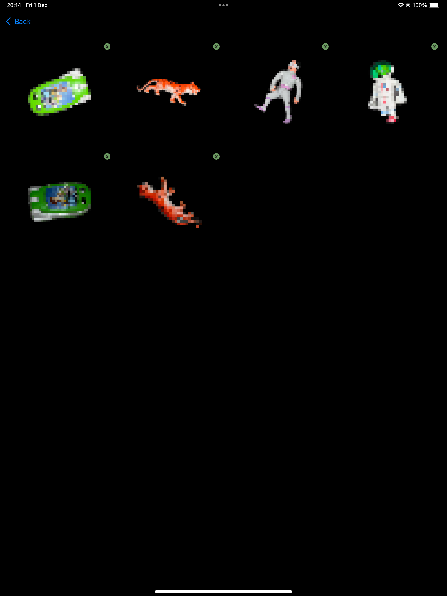

# 👋     Hello! I'm Jo

I'm an iOS developer with a linguistics background. I'm passionate about using the latest technologies to write beautifully-functioning, clean code to create impactful user experiences.

 

 

 

  
  

 
 

# Previous projects

## Circularity app MVP 
MVP native iOS app for iPhone and iPad for a circularity startup in Malmö. SwiftUI, VisionKit, Firebase, ARKit, Async/Await and MVVM.

  
  
  
  

 
 

## Internship at ustwo Nordics
During my internship at ustwo Nordics I worked as part of a cross-functional product team developing a large-scale production iOS app. I built new features in Swift, rewrote existing features to use modern Swift technology, and contributed to app direction and maintenance. SwiftUI, Combine, Async/Await, GitHub Actions, Custom APIs, MVVM.

  
  
  
  

 
 

## Body Confident Mums
Native iOS MVP for Australian body positivity organisation The Embrace Collective. The app aims to help mothers relate to their bodies in a positive way using mindfulness and journaling. This was a solo student project completed during my studies. SwiftUI, Firebase, Speech, AVFoundation, AVKit.

  
  
  
  
  
  
  

 
 

 

# My blog posts

<!-- BLOG-POST-LIST:START -->
- [Automated design token translation with Style Dictionary: A guide for non-coders](https://medium.com/@joyager/automated-design-token-translation-with-style-dictionary-2a8a3eab7e7c?source=rss-97bdfb24eaa1------2)
<!-- BLOG-POST-LIST:END -->
