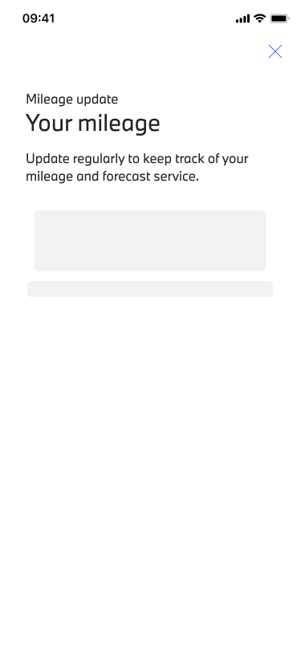
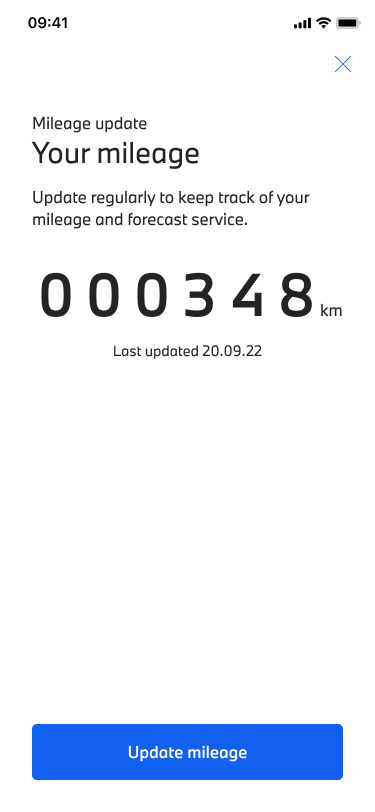
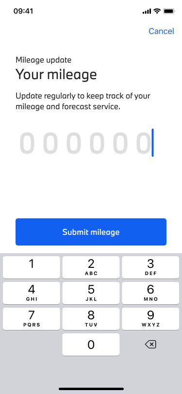
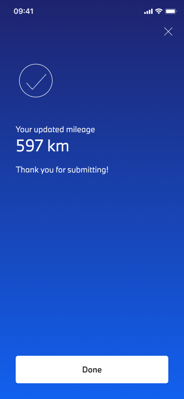
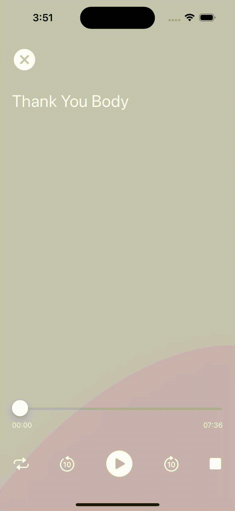
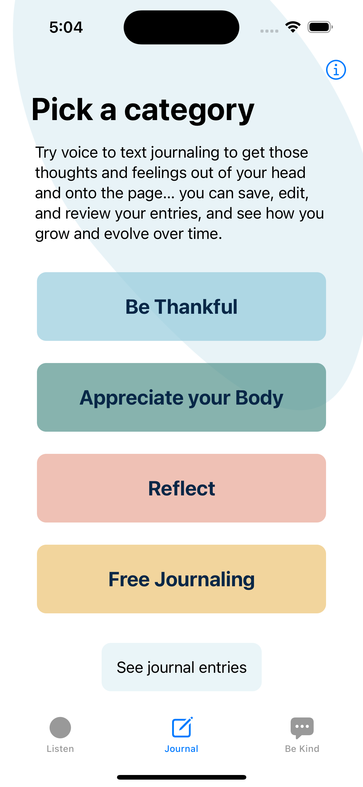
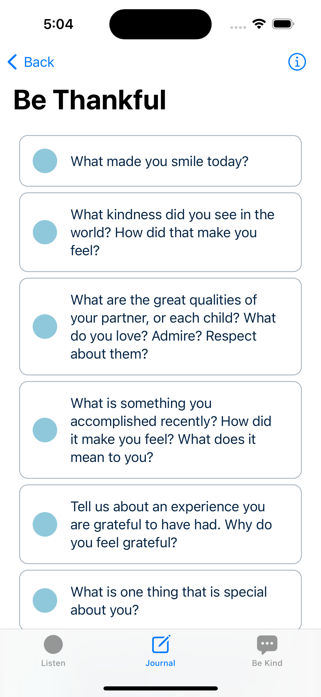

# 👋

Australian/Swedish iOS developer with a linguistics background. I use the latest iOS technologies to create impactful digital experiences.

 

  
  

 
 

# Previous projects

## Circularity app game MVP 
As the sole iOS developer for a sustainability tech startup in Malmö I architected and built a native iOS app MVP for iPhone and iPad. 

SwiftUI – VisionKit – Firebase – ARKit – Async/Await – MVVM

  
  
  
  

 
 

## Internship at ustwo Nordics
As part of a cross-functional product team I built new features in Swift, rewrote code to use modern Swift technology, redesigned app features, and contributed to code maintenance. This is one example of the features I worked on.

SwiftUI – Combine – Async/Await – GitHub Actions – MVVM

  
  
  
  

 
 

## Body Confident Mums
In collaboration with Australian body positivity organisation The Embrace Collective, I architected and built a native iOS app MVP. This was a solo project completed during my App Development studies.

SwiftUI – Firebase – Speech – AVFoundation – AVKit

  <im style="margin-right: 12px;"g width=13% src="images/ListenTab.png" alt="Alt text" title="Optional title"/>
  
  
  
  
  
  

 
 

 

# My blog posts

<!-- BLOG-POST-LIST:START -->
- [Automated design token translation with Style Dictionary: A guide](https://medium.com/@joyager/automated-design-token-translation-with-style-dictionary-2a8a3eab7e7c?source=rss-97bdfb24eaa1------2)
<!-- BLOG-POST-LIST:END -->

