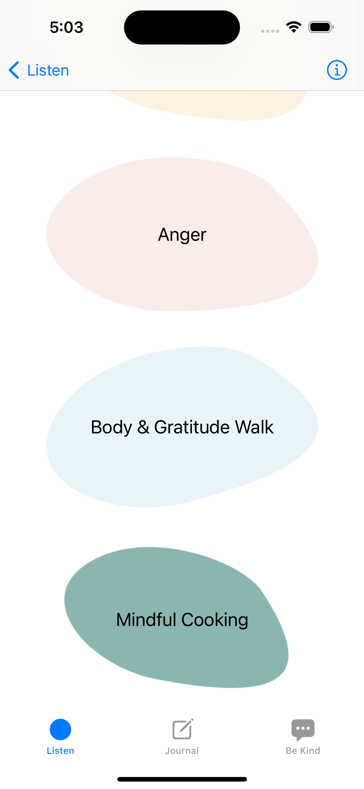

# 👋     Hello! I'm Jo

I'm a mobile app developer, working in iOS development with Swift. I love using the latest iOS coding technologies to write beautifully-functioning, clean code with attention to detail.

 

 

 

  
  
  
  
  
  

 
 

# Previous projects

## Internship
During my internship at ustwo Nordics I worked with the live iOS app, building new features in Swift using SwiftUI, rewriting old features to use modern Swift technology, and doing maintenance.

  
  
  
  

 
 

## Body Confident Mums
I created a native iOS journaling and meditation app MVP built using SwiftUI and Firebase, aimed at helping mothers with mindfulness and body image.

  
  
  
  
  
  
  

 
 

## Trivia app
As part of a group project, I created a simple trivia native iOS app with 2 other classmates using SwiftUI and the TriviaDB API.

  
  
  
  

 

# My blog posts

<!-- BLOG-POST-LIST:START -->
- [Automated design token translation with Style Dictionary: A guide for non-coders](https://medium.com/@joyager/automated-design-token-translation-with-style-dictionary-2a8a3eab7e7c?source=rss-97bdfb24eaa1------2)
<!-- BLOG-POST-LIST:END -->
